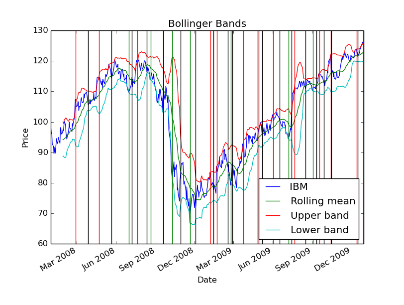
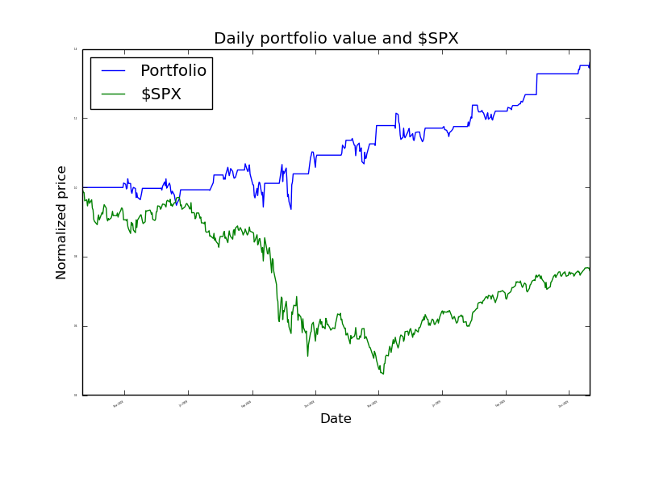
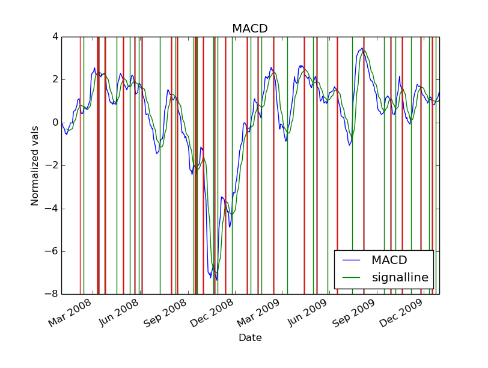
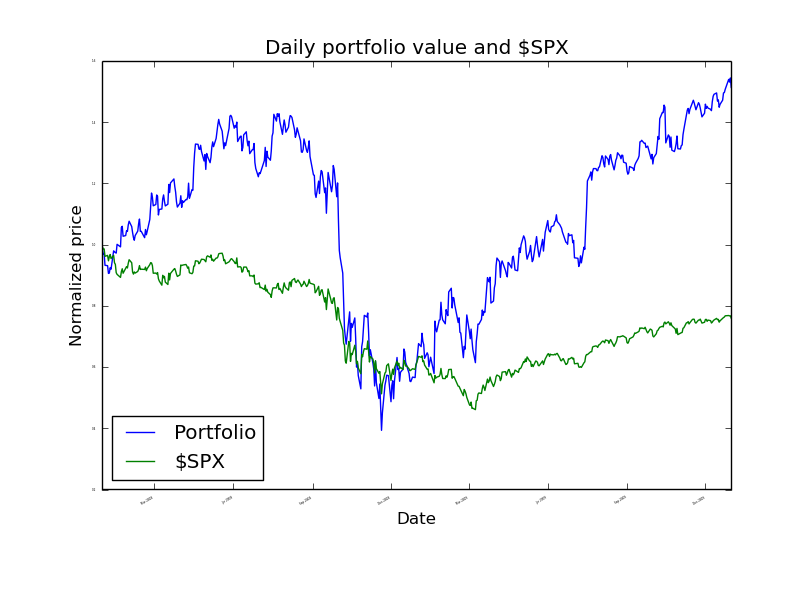

#Part 1

##Bollinger Band strategy chart



##Bollinger Band strategy backtest chart



##Summary of Bollinger Band backtest performance metrics

```
Data Range: 2007-12-31 to 2009-12-31

Sharpe Ratio of Fund: 0.97745615082
Sharpe Ratio of $SPX: -0.21996865409

Cumulative Return of Fund: 0.3614
Cumulative Return of $SPX: -0.240581328829

Standard Deviation of Fund: 0.0108802922269
Standard Deviation of $SPX: 0.0219524869863

Average Daily Return of Fund: 0.000669942567631
Average Daily Return of $SPX: -0.000304189525556

Final Portfolio Value: 13614.0

```
#Part 2

##Description

###Technical Portion

I used the Moving Average Convergence Divergence(MACD) technical indicator. This is a trend following momentum indicator that shows the relationship between two moving averages of prices. It is calculated by subtracting the 26 day exponential moving average(EMA) from the 12 day EMA for, in this case, IBM prices from 2008-2009. A nine-day EMA of the MACD is subsequently plotted on top of the MACD. Called the "signal line", it functions as a signal to buy/sell. When the MACD falls below the signal line, this is a sell signal (long exit) or a place for a short entry. Conversly when the MACD rises above the signal line, this is a buy opportunity (short exit) or a place for a long entry. This is the logic I used to determine short entry/exit and long entry/exit points.

###Fundamental Portion

IBM as an asset has shown steady growth since the mid 90s. So rather then selling off all long entry stocks at a long exit signal, I decided that I would keep 6 shares with the intention of capitalizing on IBM's growth over 2008. By the end of the year these share's pile up (+6 at each long exit signal) and result in a substantial contribution to the overall portfolio value (assuming the stock grows over the year). I also altered the quantity of shares for short entry/exits and long entry/exits in comparison with part 1. As we've learned, there is no limit to the amount of money you could lose in a short entry, as the stock could theoretically climb to infinity. In a long entry, there's an upper bound to the amount of money you could lose: the stock tanking to $0/share. Since IBM has demonstrated steady growth over the past 25 years, it would seem that you would stand to lose money if you shorted the stock over a longer period of time. Keeping this in mind I adjusted the short entry/exit quantities to 50 shares each (down from 100) and the long entry/exit quantities to 100/94 shares respectively.

##MACD strategy chart



##MACD strategy backtest chart



##Summary of backtest performance metrics

```
Data Range: 2007-12-31 to 2009-12-31

Sharpe Ratio of Fund: 0.637878377083
Sharpe Ratio of $SPX: -0.21996865409

Cumulative Return of Fund: 0.512956
Cumulative Return of $SPX: -0.240581328829

Standard Deviation of Fund: 0.0446115333818
Standard Deviation of $SPX: 0.0219524869863

Average Daily Return of Fund: 0.00179260565129
Average Daily Return of $SPX: -0.000304189525556

Final Portfolio Value: 15129.56
```
##Conclusion

The MACD strategy outperformed the Bollinger Band strategy by about 15%. However, this trading strategy proved to be more volatile as it had a lower Sharpe ratio and higher standard deviation. In this case though, the gamble appears to have paid off