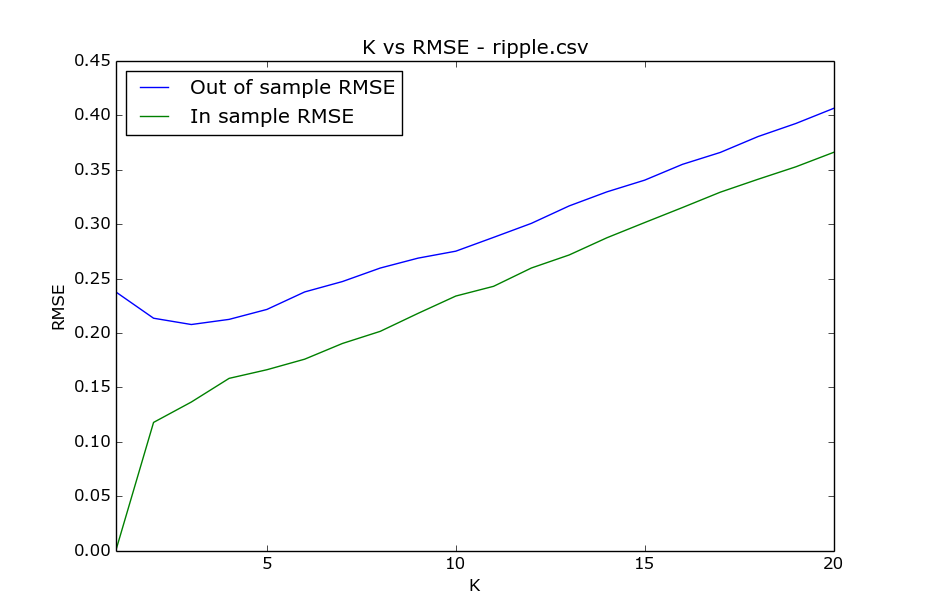
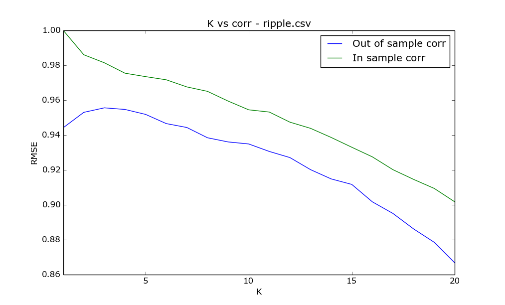
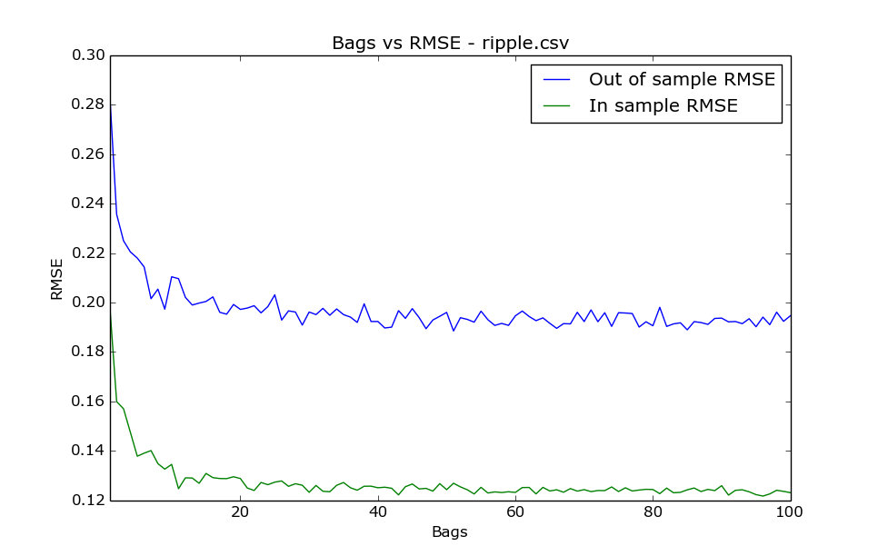
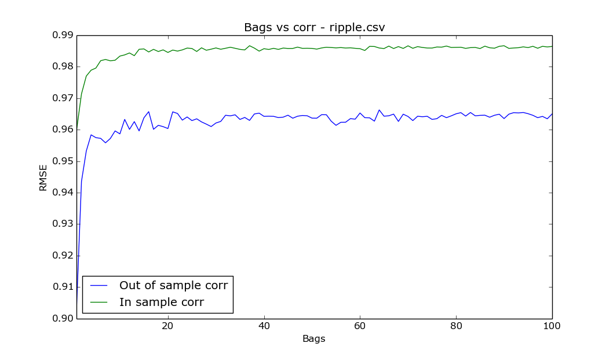

#best4linreg.py

The data generating algorithm used here involved simply generating random x1s and x2s between 4 and 12 and then finding a corresponding y using the following equation y = 4x1 + 5x2. This was done 1000 times. Although KNNLearner performs well, LinRegLearner has a much smaller RMSE for both in sample and out of sample because the relationship between x1 and y and x2 and y is strictly linear. Supporting data:

```
KNN
In sample results
RMSE:  0.0354076785981
corr:  0.999997130433

Out of sample results
RMSE:  0.0801474335903
corr:  0.999985757079

RegLearner
In sample results
RMSE:  6.60639184887e-14
corr:  1.0

Out of sample results
RMSE:  1.09155646269e-14
corr:  1.0
```

#best4KNN.py

The data generating algorithm used here involved generating random x1s and x2s between 0 and 5 and a random noise constant between 0 and 10. A corresponding y using the following equation y = x1^3 + x2^4 + noise. This was also done 1000 times. Here the relationship between x1 and y is cubed and the relationship between x2 and y is quartic. The noise constant further throws off the linearity. Thus the LinRegLearner fails us in this instance and KNNLearner is the better predictor. Supporting data:

```
KNN
In sample results
RMSE:  2.83231689284
corr:  0.999583094018

Out of sample results
RMSE:  2.94184170867
corr:  0.999608231771

RegLearner
In sample results
RMSE:  49.9680317475
corr:  0.859997784645

Out of sample results
RMSE:  51.9283208965
corr:  0.868051232856
```

#ripple.csv

##For which values of K does overfitting occur?



This question depends on what you constitute to be overfitting. When k = 1 we see that the in sample RMSE is 0, which is definitely an overfit, and the out of sample RMSE is just under .25. As k increases to 3, the out of sample RMSE is minimized, yet the in sample RMSE grows to around .15. From here on out, in sample and out of sample RMSE grows indefinitely. At around k = 6, out of sample RMSE is roughly equal to the out of sample RMSE for k = 1. So for the sake of argument if we define any RMSE lower than .25 as being an overfit then all k's below 7 overfit the out of sample data and all k's below about 13 overfit in sample data.



In this graph, our suspicion that k = 1 constitutes an overfit for in sample data is confirmed. As k increases, we see that coorelation and subsequently overfitting, decreases. Again if we say that any coorelation above say .96 is an overfit, then at roughly k >= 10 we no longer have an overfit for in sample data and for any k we don't have an overfit for out of sample data. 

##How does performance vary as you increase the number of bags? Does overfitting occur with respect to the number of bags?

##(k = 3 used for both graphs)



According to the graph, the RMSE drops off steeply as the number of bags increases from 1 to about 10 indicating an increase in performance. Any increase in bags beyond 20 does not result in any significant decrease in RMSE. Based on this sharp dip in RMSE, increases in bags up to about 20 appears to run the risk of inducing an overfit, depending on how we define an overfit.



This graph confirms our prior conclusion. Up to 20 bags, we see a spike in coorelation and performance which increases the potential for overfitting. Beyond 20 bags, we see no real increase in coorelation.

##Can bagging reduce or eliminate overfitting with respect to K for the ripple dataset?

Yes. As was covered in the lectures, a single 1NN model trained on all of the data is more likely to overfit than an ensemble of 10 1NN learners trained on 60% of the data essentially because it is an average of 10 1NN learners and so better represents the data as a whole than just a single model.