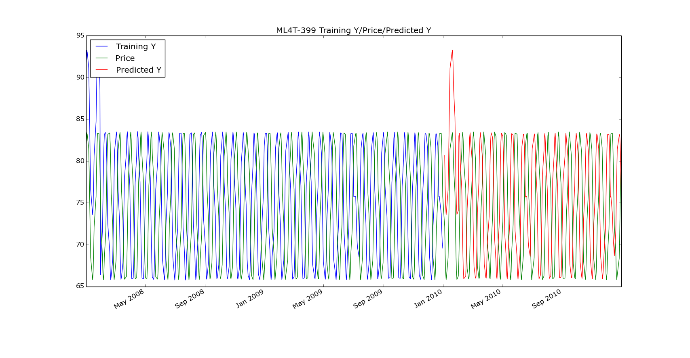
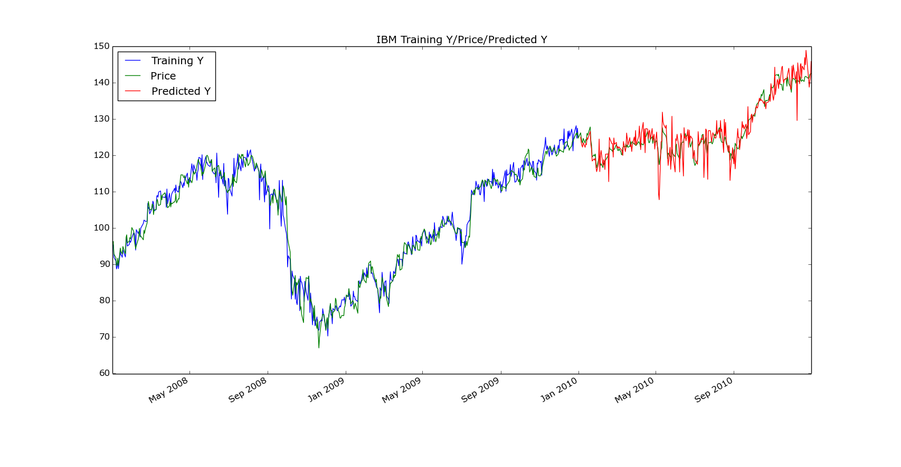
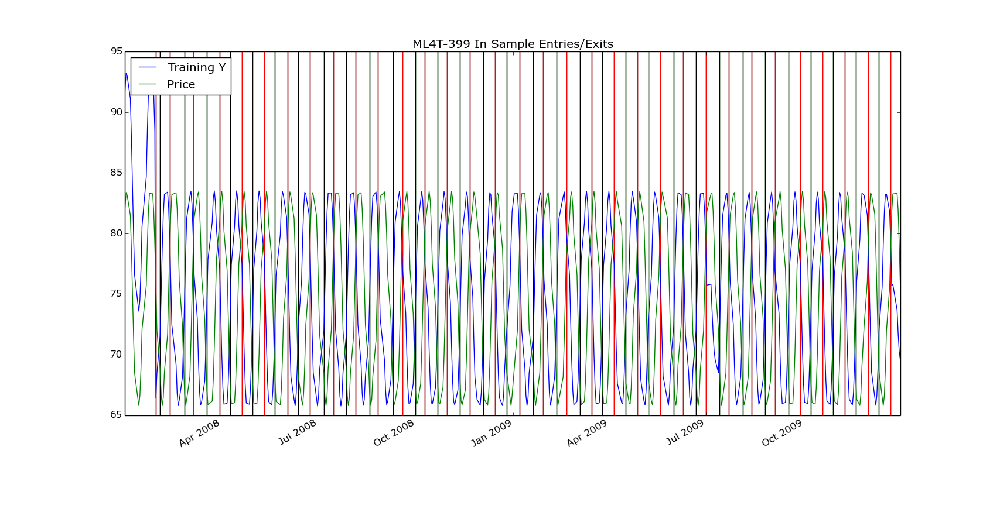
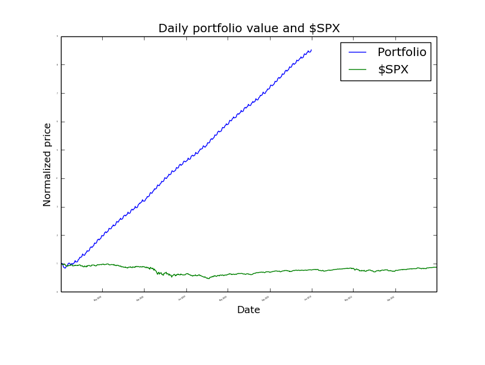
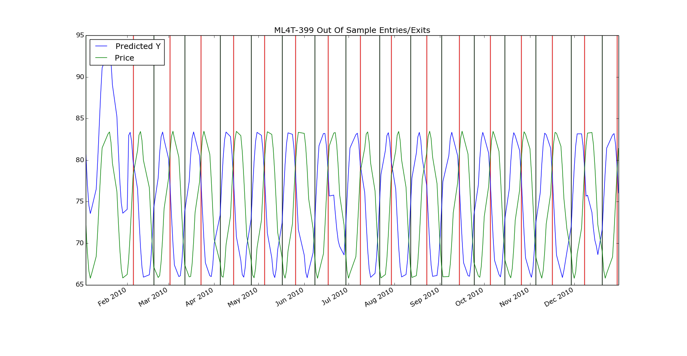
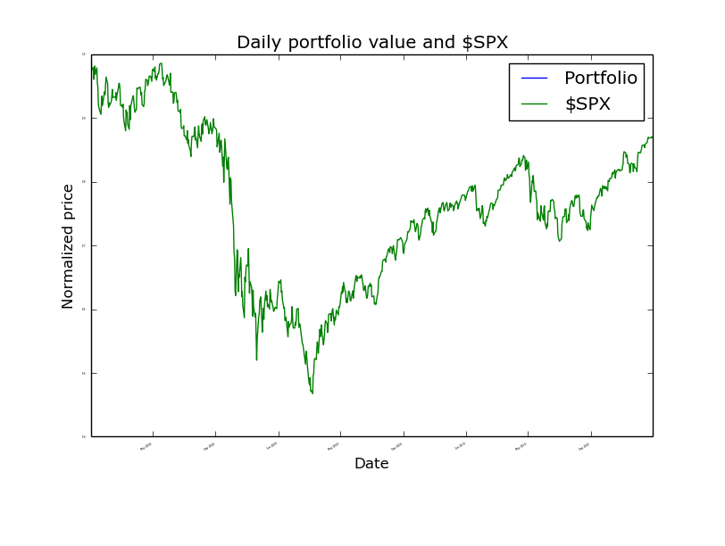
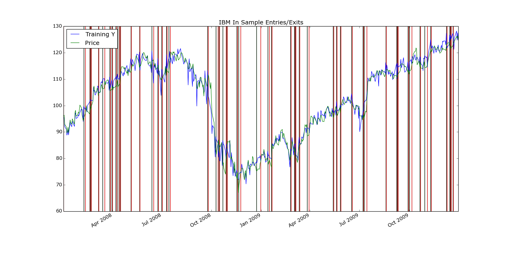
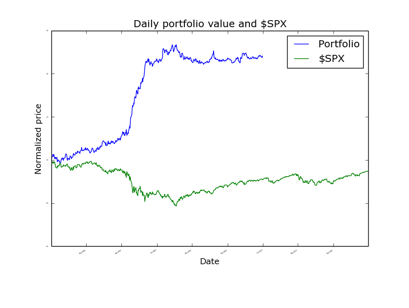
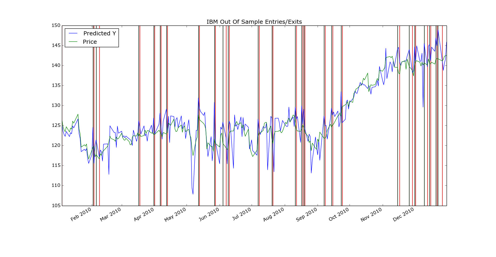

##Description

In this analysis I used a simple KNNLearner with k = 3 nearest neighbors without bagging. The three indicators used were volatility, momentum, and a normalized bollinger value. The window for momentum and the bollinger values was set at 20 trading days. My trading strategy consisted of long entries and short exits of 100 shares when the forecaster prediction was 3% higher than the price and long exits and short entries of 100 shares when the forecaster predicts a 3% lower price.  

##ML4T-399 Training Y/Price/Predicted Y



##IBM Training Y/Price/Predicted Y



##Sine Data In Sample Entries/Exits



##Sine Data In Sample Backtest



##Sine Data In Sample Performance 

```
In sample results
RMSE:  0.0428491486133
corr:  0.956678377797

Data Range: 2008-01-01 to 2010-12-31

Sharpe Ratio of Fund: 7.13936446394
Sharpe Ratio of $SPX: -0.00287478398861

Cumulative Return of Fund: 7.51847569
Cumulative Return of $SPX: -0.130959949142

Standard Deviation of Fund: 0.00957241322206
Standard Deviation of $SPX: 0.0190938081559

Average Daily Return of Fund: 0.00430507498984
Average Daily Return of $SPX: -3.45778114383e-06

Final Portfolio Value: 85184.7569
```

##Sine Data Out of Sample Entries/Exits



##Sine Data Out of Sample Backtest



##Sine Data Out of Sample Performance

```
Out of sample results
RMSE:  0.0513598080774
corr:  0.938043079126

Data Range: 2008-01-01 to 2010-12-31

Sharpe Ratio of Fund: 7.89904972141
Sharpe Ratio of $SPX: -0.00287478398861

Cumulative Return of Fund: 3.53442075
Cumulative Return of $SPX: -0.130959949142

Standard Deviation of Fund: 0.0122909545103
Standard Deviation of $SPX: 0.0190938081559

Average Daily Return of Fund: 0.00611589736307
Average Daily Return of $SPX: -3.45778114383e-06

Final Portfolio Value: 45344.2075
```

##IBM Data In Sample Entries/Exits



##IBM Data In Sample Backtest



##IBM Data In Sample Performance

```
In sample results
RMSE:  0.0339836936393
corr:  0.609356840432

Data Range: 2008-01-01 to 2010-12-31

Sharpe Ratio of Fund: 2.18375945986
Sharpe Ratio of $SPX: -0.00287478398861

Cumulative Return of Fund: 1.2042
Cumulative Return of $SPX: -0.130959949142

Standard Deviation of Fund: 0.0119227111772
Standard Deviation of $SPX: 0.0190938081559

Average Daily Return of Fund: 0.00164013483375
Average Daily Return of $SPX: -3.45778114383e-06

Final Portfolio Value: 22042.0
```

##IBM Data Out of Sample Entries/Exits



##IBM Data Out of Sample Backtest


##IBM Data Out of Sample Performance

```
Out of sample results
RMSE:  0.0333306124825
corr:  -0.0343722236

Data Range: 2008-01-01 to 2010-12-31

Sharpe Ratio of Fund: -0.896376021139
Sharpe Ratio of $SPX: -0.00287478398861

Cumulative Return of Fund: -0.2017
Cumulative Return of $SPX: -0.130959949142

Standard Deviation of Fund: 0.0141288859896
Standard Deviation of $SPX: 0.0190938081559

Average Daily Return of Fund: -0.00079780706987
Average Daily Return of $SPX: -3.45778114383e-06

Final Portfolio Value: 7983.0
```

##Conclusion

Overall my learner worked very well for in sample data achieving a 96% correlation for sine data and 61% for IBM data. My trading strategy also performed well for this in sample data with 752% and 120% returns respectively. Because of the uniformity of the sine data, the learner and trading strategy also performed well with out of sample data with a 94% correlation and 789% return. Where the learner and the trading strategy struggled was with IBM out of sample data achieving a negative correlation: -3.4% and a loss of 20%. Perhaps alternating the percentage at which buys and sells are triggered as well as the quantity of long and short shares bought and sold would yield higher performance, though it would be worth looking into a more sophisticated trading strategy and learner.


##PS 

This report was written in markdown and then saved as a pdf. In order to see the charts better, I will be including them in my submission.
